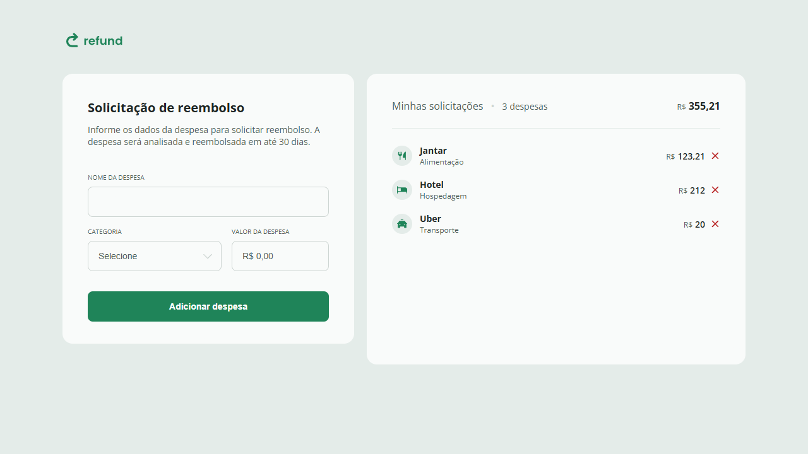
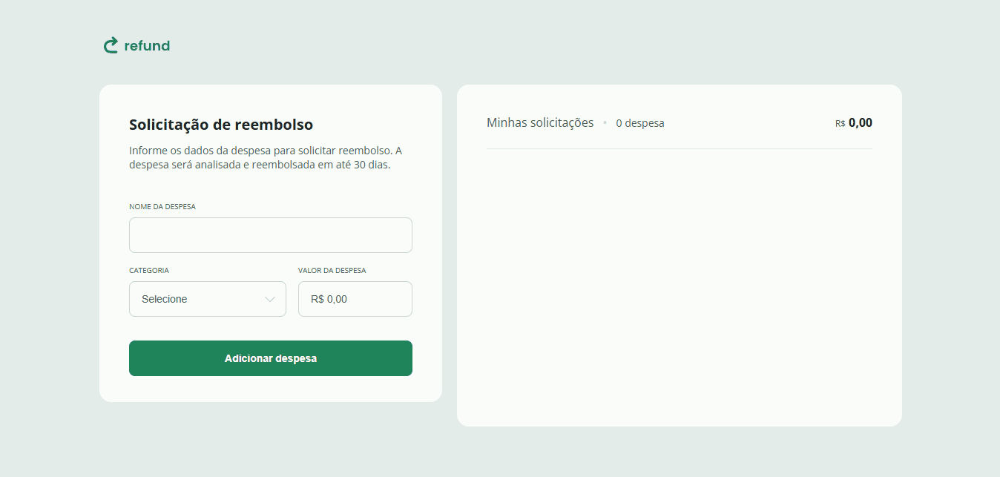

<h1 align="center">
  
</h1>

<div align="center">
  <a href="#📸-visão-do-projeto--project-view">📸 Visão do Projeto | Project View</a> -
  <a href="#ℹ-sobre-o-projeto--about-the-project">ℹ Sobre o Projeto | About the Project</a> -
  <a href="#🏗-principais-funcionalidades--main-features">🏗 Principais Funcionalidades | Main Features</a> -
  <a href="#⚙️-tecnologias--technologies">⚙️ Tecnologias | Technologies</a> -
  <a href="#🧪-testar-o-projeto---clique-no-botão--test-the-project---click-on-the-button">🧪 Testar o Projeto - Clique no botão | Test the Project - Click on the button</a> -
  <a href="#🎨-template---clique-na-miniatura--template---click-on-the-thumbnail">🎨 Template - Clique na miniatura | Template - Click on the thumbnail</a> -
  <a href="#💻-clonagem-do-repositório--repository-cloning">💻 Clonagem do Repositório | Repository Cloning</a> -
  <a href="#🤝-contribuições--contributions">🤝 Contribuições | Contributions</a> -
  <a href="#👨‍💻-autor--author">👨‍💻 Autor | Author</a>
</div>

## 📸 Visão do Projeto | Project View

<div align="center">
  
  

</div>

## ℹ Sobre o Projeto | About the Project

### 🌐 Português

Neste projeto, fui responsável pelo desenvolvimento da lógica JavaScript para o gerenciamento de despesas. O desafio consistia em criar uma funcionalidade de adição e remoção de despesas com interação dinâmica na interface. A principal tarefa foi implementar a lógica de processamento e exibição das despesas de forma eficiente, permitindo ao usuário adicionar novos itens, categorizar cada despesa e visualizar o total de gastos atualizados em tempo real.

Utilizei o JavaScript para manipulação do DOM, eventos de input e submit de formulário, além de realizar o cálculo dinâmico do valor total das despesas. Através da criação de funções para formatar valores em reais (BRL), adição e remoção de despesas, e atualização dos totais exibidos na interface, consegui garantir uma experiência fluida ao usuário. A interação com os dados da despesa também foi gerenciada de forma otimizada, utilizando a criação de elementos de lista dinâmicos e remoção de itens quando necessário.

O resultado final foi um sistema interativo e funcional, onde os usuários podem facilmente registrar e remover despesas, enquanto o total é automaticamente recalculado. Este projeto me permitiu aprimorar minhas habilidades em manipulação de DOM e na criação de soluções práticas com JavaScript, além de melhorar minha capacidade de lidar com dados de forma eficiente em interfaces dinâmicas.

### 🌐 English

In this project, I was responsible for developing the JavaScript logic for managing expenses. The challenge was to create a functionality for adding and removing expenses with dynamic interaction in the interface. The main task was to implement the processing logic and display of expenses efficiently, allowing the user to add new items, categorize each expense, and view the total amount updated in real-time.

I used JavaScript for DOM manipulation, input and form submission events, as well as performing dynamic calculations of the total expenses. By creating functions to format values in BRL (Brazilian Real), adding and removing expenses, and updating the totals displayed in the interface, I ensured a smooth user experience. Interaction with expense data was also managed efficiently, using dynamic list item creation and removal when needed.

The final result was an interactive and functional system where users can easily record and remove expenses, with the total amount automatically recalculated. This project allowed me to improve my skills in DOM manipulation and creating practical solutions with JavaScript, as well as enhancing my ability to handle data efficiently in dynamic interfaces.

## 🏗 Principais Funcionalidades | Main Features

### 🌐 Português

- [x] **Adição de despesas:** Permite que o usuário adicione novas despesas, fornecendo informações sobre o nome, categoria e valor, com validação dos dados do formulário para garantir entradas corretas.

- [x] **Cálculo e exibição do total de despesas:** Atualiza automaticamente o valor total das despesas sempre que uma nova despesa é adicionada ou removida, exibindo o valor total em tempo real.

- [x] **Exibição das despesas na interface:** Cada despesa adicionada é exibida com as informações de nome, categoria e valor, além de um ícone de remoção para permitir que o usuário exclua despesas da lista.

- [x] **Remoção de despesas:** Oferece ao usuário a opção de remover despesas da lista, recalculando automaticamente o total de despesas após a exclusão.

- [x] **Formatação de valores:** Os valores das despesas são automaticamente formatados em reais (R$), garantindo consistência na exibição de valores tanto no campo de entrada quanto na lista de despesas.

- [x] **Interação dinâmica com o DOM:** Utiliza eventos de entrada e submit para manipular dinamicamente os elementos da interface, atualizando a lista de despesas e o valor total de forma eficiente e em tempo real.

### 🌐 English

- [x] **Expense addition:** Allows the user to add new expenses by providing information about the name, category, and amount, with form validation to ensure correct data input.

- [x] **Total expenses calculation and display:** Automatically updates the total amount of expenses whenever a new expense is added or removed, displaying the total value in real-time.

- [x] **Display of expenses in the interface:** Each added expense is displayed with information such as name, category, and amount, along with a removal icon to allow the user to delete expenses from the list.

- [x] **Expense removal:** Provides the user with the option to remove expenses from the list, automatically recalculating the total expenses after deletion.

- [x] **Value formatting:** Expense values are automatically formatted in Brazilian reais (R$), ensuring consistency in the display of values both in the input field and the expense list.

- [x] **Dynamic DOM interaction:** Uses input and submit events to dynamically manipulate the interface elements, efficiently updating the expense list and total value in real-time.

## ⚙️ Tecnologias | Technologies

- <a href="https://www.w3schools.com/html/default.asp"> HTML</a>
- <a href="https://www.w3schools.com/css/"> CSS</a>

## 🧪 Testar o Projeto - Clique no botão | Test the Project - Click on the button

<a href="https://henry-frrz.github.io/refund/">
  
</a>

## 🎨 Template - Clique na miniatura | Template - Click on the thumbnail

<a align="center" href="https://github.com/rocketseat-education/refund-template">
  
</a>

## 💻 Clonagem do Repositório | Repository Cloning

### 🌐 Português

1. **Requisitos:** Você precisa apenas de um navegador para executar este projeto.

2. **Baixar o Projeto:** Clique no botão **Code** e selecione **Download ZIP**, depois extraia os arquivos no local desejado. Alternativamente, você pode clonar o repositório usando Git:

```bash
git clone https://github.com/henry-frrz/refund.git
```

3. **Abrir o Projeto:** Localize os arquivos extraídos ou clonados e abra o arquivo `index.html` no seu navegador.

### 🌐 English

1. **Requirements:** You only need a web browser to run this project.

2. **Download the Project:** Click on the **Code** button and select **Download ZIP**, then extract the files to your preferred location. Alternatively, you can clone the repository using Git:

```bash
git clone https://github.com/henry-frrz/refund.git
```

3. **Open the Project:** Locate the extracted or cloned files and open the index.html file in your browser.

## 🤝 Contribuições | Contributions

### 🌐 Português

Se você deseja contribuir para o projeto, siga as diretrizes abaixo:

1. Faça um fork do repositório no GitHub.

2. Crie uma nova branch para sua contribuição:

```bash
git checkout -b feature/sua-contribuicao
```

3. Faça as alterações necessárias e teste para garantir que as mudanças sejam robustas e confiáveis.

4. Envie suas alterações com um pull request (PR).

5. Após revisão e aprovação, suas alterações serão incorporadas ao projeto.

### 🌐 English

If you would like to contribute to the project, please follow the contribution guidelines below:

1. Fork the repository on GitHub.

2. Create a new branch for your contribution:

```bash
git checkout -b feature/your-contribution
```

3. Make any necessary changes, and test them to ensure that the changes are robust and reliable.

4. Submit your changes with a pull request (PR).

5. After review and approval, your changes will be incorporated into the project.

## 👨‍💻 Autor | Author

<a href="https://github.com/henry-frrz">

</a>
<br>
